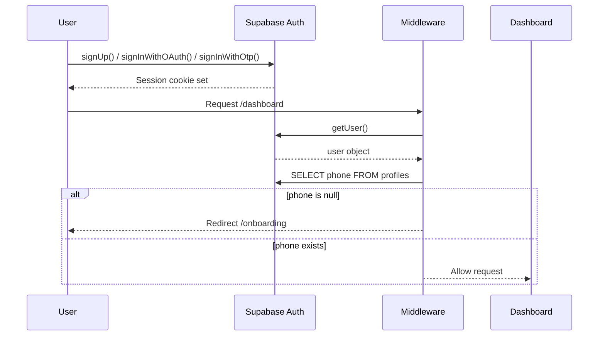
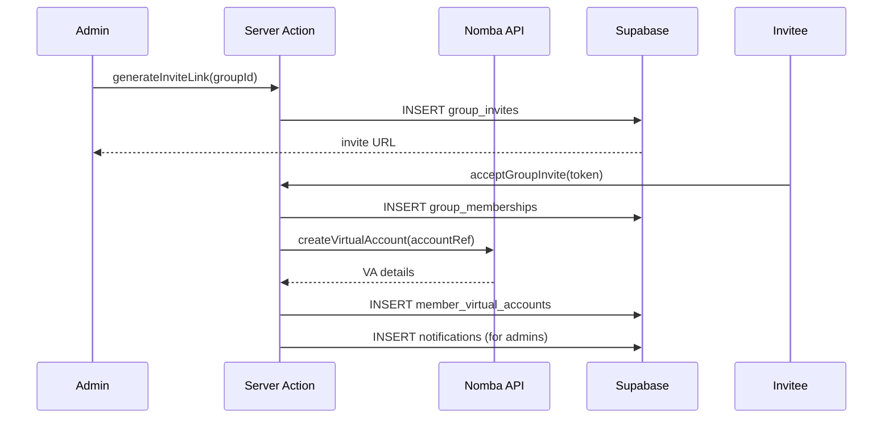
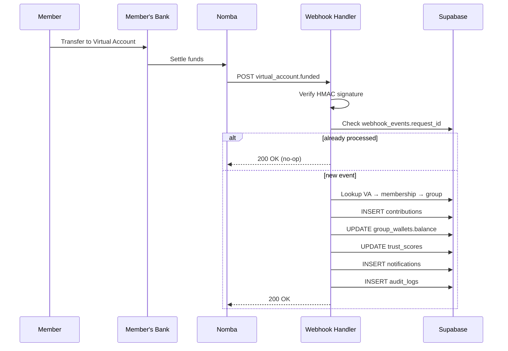
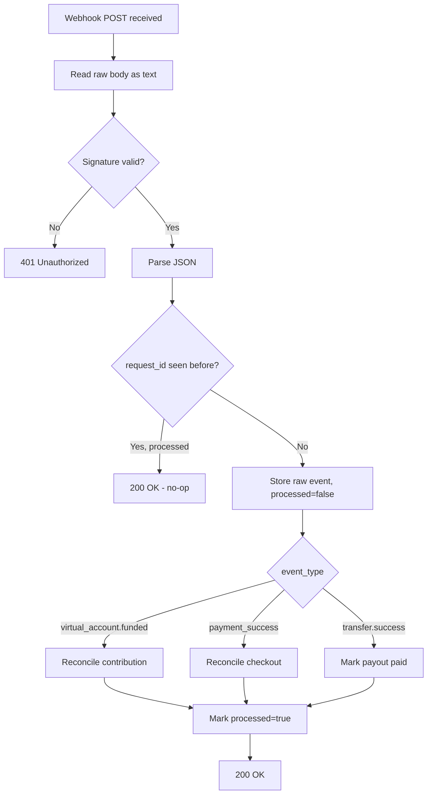
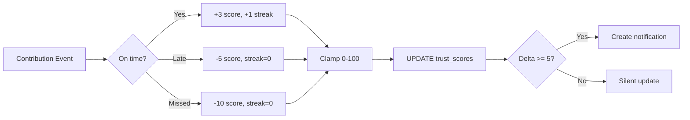
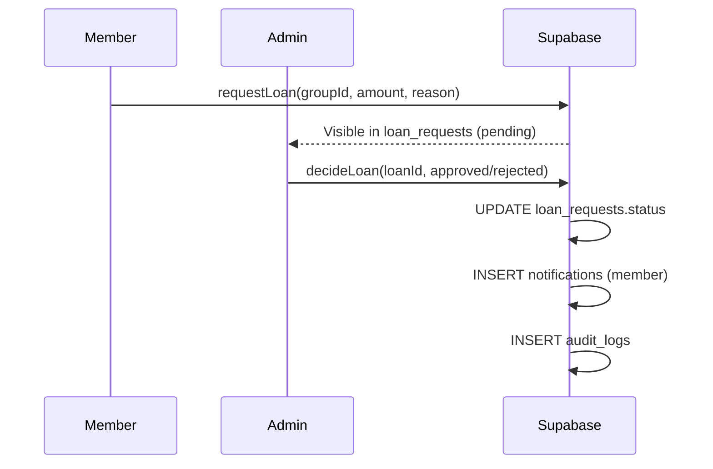
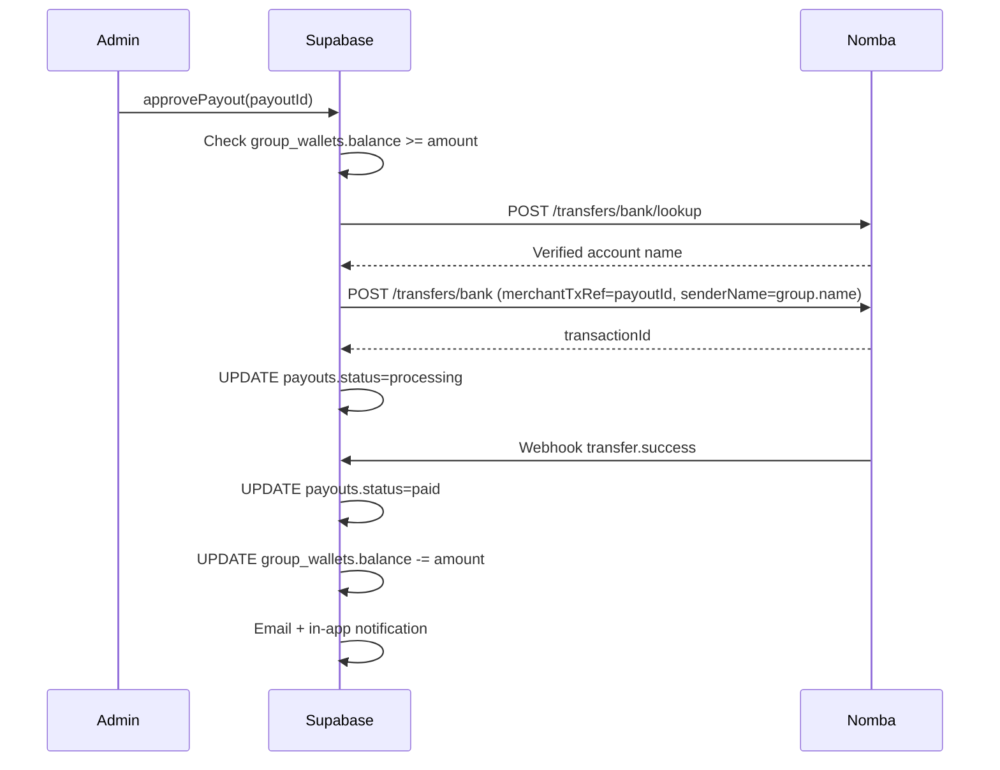
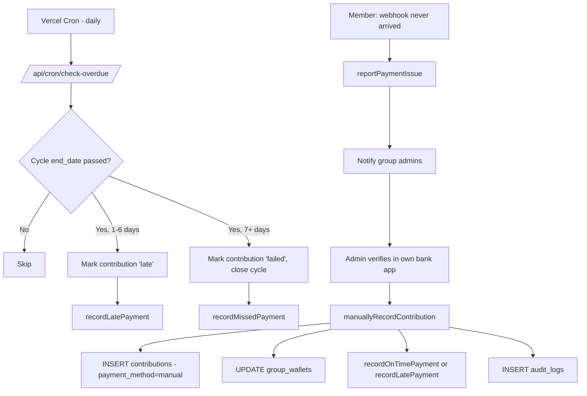
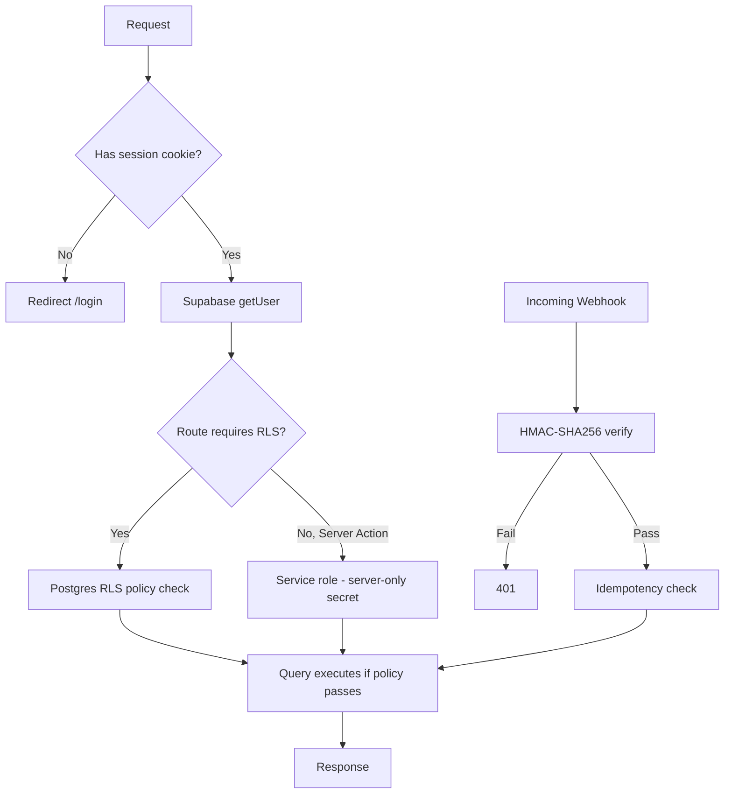

# AjoFlow — System Architecture

## High-Level System Diagram

```mermaid
graph TD
    A[Member - Mobile/PWA] -->|HTTPS| B[Next.js App Router]
    B --> C[Server Actions]
    B --> D[Route Handlers]
    C --> E[(Supabase PostgreSQL)]
    D --> F[Nomba API]
    F -->|Webhook| G[/api/webhooks/nomba]
    G --> H[HMAC Verify]
    H --> I[Idempotency Check]
    I --> E
    E --> J[Trust Engine]
    E --> K[Notification System]
    K --> L[Resend Email]
    B --> M[Groq AI Router]
    M --> N[Primary Endpoint]
    M --> O[Secondary Endpoint]
    M --> P[Tertiary Endpoint]
    Q[Vercel Cron - daily] --> R[/api/cron/check-overdue/]
    R --> E
```

## Frontend Architecture

Next.js 15 App Router with three route groups:
- `(auth)` — public login/signup, no sidebar
- `(dashboard)` — authenticated shell with Sidebar (desktop) / MobileNav (mobile)
- Root-level `onboarding`, `invite/[token]` — special-case flows outside the dashboard shell

Server Components fetch data directly via Supabase server client. Client Components (`"use client"`) are used only for forms, modals, and the AI chat interface.

## Backend Architecture

No separate backend service — Next.js Server Actions (`features/*/actions.ts`) and Route Handlers (`app/api/*`) form the entire backend. This eliminates a network hop between frontend and backend logic while keeping all secrets server-side.

```
Client Component
  → Server Action (features/payments/actions.ts)
    → Zod validation
    → Supabase service client (bypasses RLS for trusted server logic)
    → Nomba API call
    → Database write
    → revalidatePath()
  → Client re-renders with fresh data
```

## Database Architecture

PostgreSQL via Supabase. 20 tables, full RLS coverage. See `docs/database.md` for table-by-table detail.

Auto-provisioning triggers:
- `handle_new_user()` — `auth.users` insert → `profiles` row
- `create_trust_score_on_membership()` — `group_memberships` insert → `trust_scores` row (score: 100)
- `create_group_wallet_on_group()` — `groups` insert → `group_wallets` row (balance: 0)

## Authentication Flow Diagram



## Group Membership Flow Diagram



## Contribution Flow Diagram (Virtual Account)



## Webhook Processing Flow



## Trust Score Engine Flow



**All three branches are now actually reachable.** For a while, every contribution — regardless of actual timing — was recorded as "on time" (the webhook handler called `recordOnTimePayment()` unconditionally), and the "Missed" branch had no caller anywhere in the codebase. Fixed:
- The webhook handler and `manuallyRecordContribution()` now check the active cycle's `end_date` and call `recordLatePayment()` when a payment is genuinely late.
- `/api/cron/check-overdue` (daily) is what actually reaches the "Missed" branch, for contributions nobody ever pays at all.

`getLoanEligibility(score)` also reads from this same `trust_scores` table to gate loan requests — score < 40 is rejected, otherwise the requestable amount is capped at a multiplier of the group's contribution amount.

## Loan Approval Flow



## Payout Flow Diagram



`senderName` is a required Nomba field that was missing entirely from the original transfer call — every real payout would have failed with `HTTP 422`. `approvePayout()` itself also had no UI calling it for a while after being written; it's now surfaced as an "Awaiting Your Approval" list on the Payouts page.

## Overdue Detection & Manual Reconciliation Flow



The right-hand path exists because of a platform-wide Nomba webhook reliability issue reported by multiple hackathon teams on July 5, 2026 — see `docs/nomba-integration.md` for the full account. It is a fallback, not a replacement for the webhook.

## Security Layer Diagram



## Infrastructure / Deployment Architecture

```
GitHub Repo (Ememzyvisuals/Ajoflow-hackathon)
        │
        ▼
   Vercel (build + deploy on push to main)
        │
        ├── Edge Middleware (session refresh, onboarding gate)
        ├── Server Components / Actions (Node.js runtime)
        └── Static assets (icons, manifest, service worker)
        │
        ▼
   Supabase (managed Postgres + Auth + RLS)
        │
        ▼
   Nomba API (sandbox/production via NOMBA_ENV)
        │
        ▼
   Groq API (3-key failover pool)
   Resend API (transactional email)
```
